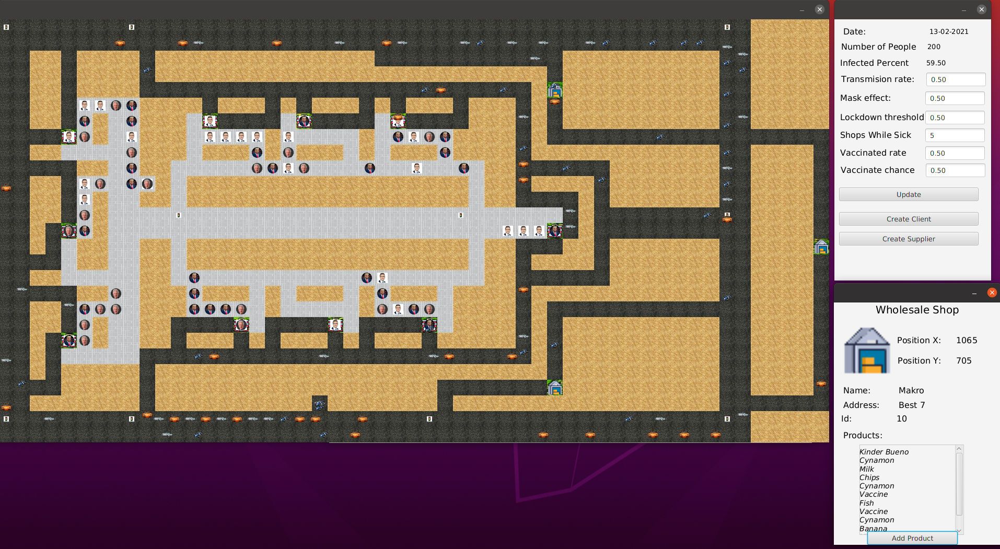
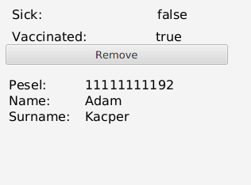
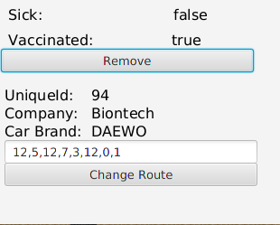
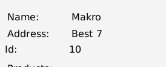
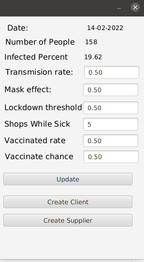

# PandemySimulation
Author: Kacper Trębacz 145453

Instructions:
I have had a problem building a runnable jar, I needed to use such a command:
```
java --module-path /usr/local/javafx-sdk-11.0.2/lib --add-modules javafx.controls,javafx.fxml,javafx.base -jar PandemySimulation-1.0-SNAPSHOT.jar 
```
jar file is located:
`` 
./target/PandemySimulation-1.0-SNAPSHOT.jar
``

Documentation is located:
``
/target/apidocs
``

# App Window
App consists of three windows.
*Map panel on left
*Control panel in top right corner
*Information panel in right bottom corner



# Instructions

##  Information Window
To view information about an object in simulation click it. The information will appear in information window.

### Removing objects
To remove Supplier or Client click remove button .



### Change Supplier route

To Change Supplier Route you need to provide a comma separated string of shop ids. You can get a shop id in its InformationPanel.




### Control panel

On control panel the user can add or delete suppliers or clients. Suppliers and Clients have their predefined spawn points.

User can also view Simulation stats and change simulation properties and confirm changes with Update button:
Simulation properties are:
* Transmission rate (0-1) the probability of transmission
* Mask effect (0-1) the effect that mask has on probability of transmission (Transmission rate is multiplied by it)
* Lockdown threshold - a threshold which tells above which value of Infected Percentage a lockdown will be introduced
* Shops While Sick - the number of shops a person has to visit until it recovers from disease
* Vaccination rate - the effect vaccination has on getting a disease from someone (Transmission rate is multiplied by it)
* Vaccination chance - a chance that newly created person will be vaccinated

# Additional Information
Deadlock detection is performed by checking on which tile a person currently is and to which it wants to go. Then those dependencies are transformed into a graph, and if the circle is found is, each Person involved that is not currently in a Shop will be deleted from Map.